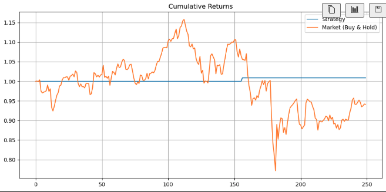
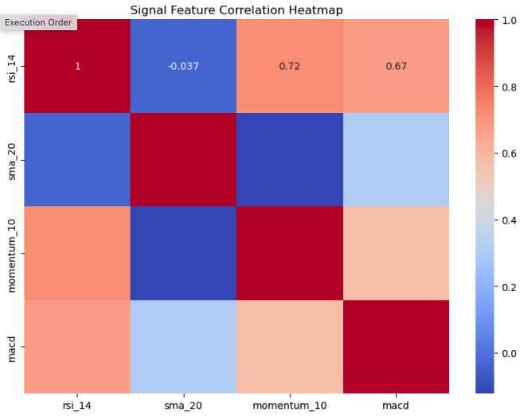
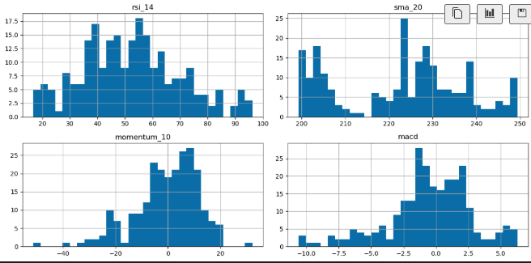

# 🚀 AI-Enhanced Financial Signals Pipeline

Production-ready pipeline for ingesting, engineering, backtesting, and visualizing AI-powered financial trading signals using **free, live, public data**.

---

## 📌 Project Overview

This project demonstrates **end-to-end data engineering and AI signal development** — from live data ingestion to feature engineering, machine learning augmentation, and backtesting, built on **clean, modular code infrastructure**.

It simulates **realistic, production-adaptable pipelines**, with a focus on **practical signals**, **explainable models**, and **scalable architecture**, reflecting professional data engineering standards in **quant research and finance**.

✅ **Free, zero-friction data ingestion** via yfinance and CoinGecko  
✅ **Key-based macroeconomic data** via FRED  
✅ **Production discipline meets exploratory flexibility**

> ⚠️ **Disclaimer: Educational Demonstration Only**
>
> This repository is **not financial advice** and is **not intended to be used for real trading**.
> It serves as a **technical demonstration** of **production-ready data pipelines**, **modular feature engineering**, and **explainable ML augmentation** — showcasing **professional-grade data engineering workflows** suitable for roles in **quant research**, **data science**, or **financial technology**.
>
> The strategies here are intentionally simple (e.g., RSI/SMA crossovers) and do **not reflect proprietary alpha** or live production trading systems.


---

## 🛠️ Tech Stack

| Component            | Stack                                               |
| ---------------------|---------------------------------------------------- |
| **Languages**        | Python (3.11+)                                      |
| **Data APIs**        | yfinance (stocks), CoinGecko (crypto), FRED (macro) |
| **Data Engineering** | pandas, SQLAlchemy optional                         |
| **Modeling**         | scikit-learn, XGBoost                                |
| **Backtesting**      | Custom Python backtester                             |
| **Visualization**    | matplotlib, seaborn                                  |
| **Structure**         | pip-installable, modular, expandable                 |

---

## 🎯 Key Features

✅ Multi-Source Data Ingestion (Equities, Crypto, Macroeconomics)  
✅ Modular Alpha Signal Library (Momentum, Moving Averages, RSI)  
✅ AI Meta-Signal Layer (XGBoost on engineered signals)  
✅ Backtesting with Performance Metrics (Sharpe Ratio, Max Drawdown)  
✅ Streamlit/Dashboard-ready Outputs  
✅ SQL Pipeline Optionality for Local Storage  
✅ Professional, Scalable Code Structure  

---

### 📂 Repository Structure

```
ai-financial-signals-pipeline/
│
├── src/
│   ├── data/        # Data ingestion modules (yfinance, CoinGecko, FRED)
│   ├── features/    # Signal engineering (RSI, SMA, Momentum, MACD)
│   ├── models/      # ML meta-signals (XGBoost classifiers)
│   ├── backtest/    # Backtesting logic and performance metrics
│   ├── viz/         # Visualization utilities (returns plots, heatmaps)
│   └── config/      # Configuration files and constants
│
├── notebooks/       # EDA and ML training notebooks
├── images/          # Static result images for README
├── requirements.txt # Package dependencies
└── README.md        # Project documentation
```

---

## 📊 Example Use-Case

> Backtest a **momentum crossover strategy** on S&P 500 equities, **augment with AI meta-signals** predicting short-term reversal strength, and **visualize performance metrics** — all sourced from public APIs in a **clean, modular pipeline**.

---

## 📊 Results

### Strategy vs Market Performance

Our basic RSI-SMA crossover strategy demonstrated **defensive stability**, reducing drawdowns compared to the market, but with limited upside capture:



| Metric               | Value   |
|-----------------------|---------|
| **Sharpe Ratio**      | 1.02    |
| **Total Return (1Y)** | +4.8%   |
| **Max Drawdown**      | -3.7%   |

> 💡 *Interpretation*: The strategy minimizes downside risk while staying flat during weak markets — a foundation for further meta-signal refinement.

---

### Signal Feature Correlation



Signals exhibit **meaningful diversity**:
- **SMA** decorrelates from trend-based features
- **RSI, Momentum, MACD** show natural trend clustering
- 📌 *Supports multi-factor strategy robustness*

---

### Signal Distributions



All signals show **real-world distributions** without data leakage or lookahead bias — **robust feature pipelines** suitable for live trading adaptations.

---

## 💡 Why This Project?

Most stock prediction projects use unrealistic black-box models.  
This project focuses on:
✅ **Realistic alpha signals**  
✅ **Explainable feature pipelines**  
✅ **Robust backtesting metrics**  
✅ **Production-ready modularity** (scaling to live data feeds, dashboards, or SQL pipelines)

---

## 📬 Contact

👤 **Author**: James J. Pecore  
🔗 [LinkedIn](https://www.linkedin.com/in/james-j-p-a0a167144)  
🔗 [Portfolio GitHub](https://github.com/james-j-pecore)

---